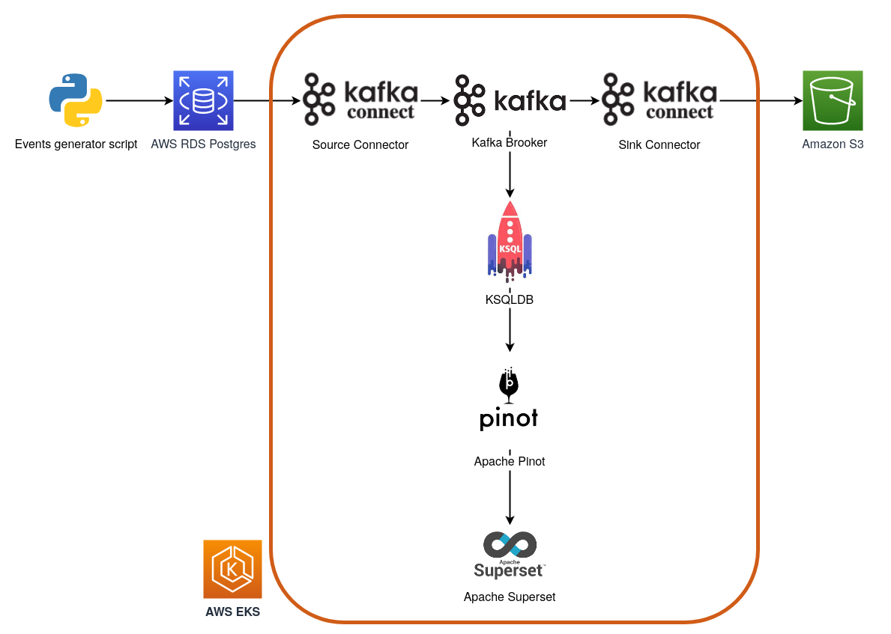
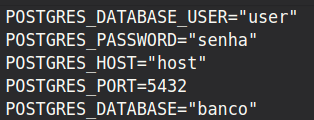

## Arquitetura Orientada a Eventos



## Origem

Esse projeto é altamente inspirado na arquitetura mostrada pelo [@carlosbpy](https://github.com/carlosbpy) no Bootcamp Engenheiro de Dados Cloud do [IGTI](https://online.igti.com.br/)   

## Como usar


### 1. Banco de dados

1.1 Suba um banco Postgres no seu cloud provider favorito e permita que ele possa ser acessado de qualquer lugar. Na AWS basta criar novas *inboud rules* no *security group* do seu banco.

1.2. Conecte no seu banco e execute o SQL contido no arquivo [schema.sql](api/schema.sql)

---

### 2. Script Python
2.1. Crie um arquivo chamado ```.env``` na pasta [api/](api/) 


2.2. No seu .env coloque as informações do banco, por exemplo:
  
  


2.3. Execute o arquivo [insert_customers_postgres.py](api/insert_customers_postgres.py), que é o responsável por gerar nossos dados e inseri-los no banco, por exemplo:
```shell
$ python3 insert_customers_postgres.py -n 100 --silent true
```

2.4. Confira se os dados chegaram no banco.

---

### 3. Cluster Kubernetes

3.1. Customize o arquivo [create-eks.sh](infra/create-eks.sh) e o execute para subir um cluster kubernetes no AWS EKS.

3.2. Com o cluster up, crie os namespaces *ingestion*, *processing* e *datastorage*.

---

### 4. Strimzi Operator

4.1. Para não ter que passar o namespace em todo comando executado pelo kubectl usarei o [kubens](https://github.com/ahmetb/kubectx) para deixar o *ingestion* como namespace padrão:
```shell
$ kubens ingestion
```

4.2. Execute o script [install-strimzi-helm.sh](kafka-strimzi-k8s-v1beta1/install-strimzi-helm.sh)

4.3. Confira se o operator está disponível:
```shell
$ helm ls
```
```shell
$ k get pods
```
```shell
$ k get all
```

---

### 5. Kafka Brooker

5.1. Para subir o Kafka Brooker usando o Strimzi, customize o arquivo [broker.yml](kafka-strimzi-k8s-v1beta1/kafka-brokers-cluster/broker.yml) e em seguida aplique seu manifesto:

```shell
$ k apply -f kafka-strimzi-k8s-v1beta1/kafka-brokers-cluster/broker.yml
```

5.2. Confira se o Brooker está disponível:
```shell
$ k get pods
```
```shell
$ k get kafkatopics
```

---

### 6. Kafka Connect

6.1. Antes de subir o cluster de Kafka Connect precisamos customizar a imagem Docker para que ela tenha os JARs de connectors que precisamos.

6.2. Primeiro precisamos customizar o arquivo [create-ecr-repository.sh](infra/create-ecr-repository.sh) mudando o nome do profile e do repositório. Esse repositório será seu hub privado de imagens Docker.

6.3. Uma vez que o repositório foi criado será possível acessá-lo pelo console da AWS. No canto superior direito da página do repositório existe um botão com instruções de como subir uma imagem para ele, copie e cole os comandos ou customize o arquivo [build-and-push-img-strimzi.sh](kafka-strimzi-k8s-v1beta1/build-and-push-img-strimzi.sh) e o execute.

6.4. Coloque o URI da sua imagem do ECR no campo *spec.image* do arquivo [connect.yml](kafka-strimzi-k8s-v1beta1/kafka-connect-cluster/connect.yml)

6.5. Para subir o cluster de Kafka Connect usando o Strimzi, customize o arquivo [connect.yml](kafka-strimzi-k8s-v1beta1/kafka-connect-cluster/connect.yml) e em seguida aplique seu manifesto:

```shell
$ k apply -f kafka-strimzi-k8s-v1beta1/kafka-connect-cluster/connect.yml
```
6.6. Confira se o Cluster está disponível:
```shell
$ k get pods
```

---

### 7. Source Connector

7.1. No arquivo [ingest-src-postgres-customers-json.yml](kafka-strimzi-k8s-v1beta1/source-connector/ingest-src-postgres-customers-json.yml), customize os campos:

* ```metadata.name```: Nome do seu connector
* ```metadata.labels.strimzi.io/cluster```: Nome do seu Kafka Connect Cluster criado anteriormente
* ```specs.config.connection.url```: URL de conexão pro seu banco de dados postgres
*  ```specs.config.connection.user``` e ```specs.config.connection.password```: Usuário e senha do seu banco de dados.
  
7.2. Aplique o manifesto:

```shell
$ k apply -f kafka-strimzi-k8s-v1beta1/source-connector/ingest-src-postgres-customers-json.yml
```
7.3. Confira se o Connector está disponível:
```shell
$ k get kafkaconnectors
```

Com isso já conseguiremos ver nossos dados do Postgres no tópico Kafka. Pra fazer isso basta rodar o script de ingestão de dados e em seguida executar o comando:
```shell
$ k exec nome-pod-broker -c kafka -it -- bin/kafka-console-consumer.sh --bootstrap-server localhost:9092 --property print.key=true --from-beginning --topic src-postgres-customers-json
```

---

### 8. Sink Connector

### TODO

---

### 9. KSQLDB

9.1. Mude para o namespace *processing*

```shell
$ kubens processing
```

9.2. O KSQLDB não faz parte da stack do Strimzi, mas conseguimos integrar as ferramentas.

9.3. No arquivo [deployment.yml](ksqldb-server/manifests/deployment.yml), customize os campos 

* ```spec.template.spec.containers.env.KSQL_BOOTSTRAP_SERVERS.value```: Nome do svc do seu cluster Kafka 

9.4. Aplique os manifestos simultaneamente

```shell
$ k apply -f ksqldb-server/manifests/
```
9.5. Confira se deu certo
```shell
$ k get pods
```
9.6. Para criarmos as streams precisaremos utilizar o shell do KSQL.

```shell
$ k exec nome-do-pod -it -- bash ksql
```

9.7. Dentro do KSQL existem alguns comandos úteis como:

* ```show topics;``` - Mostra os tópicos Kafka disponíveis pra serem consumidos pelo KSQL.
*  ```show streams;``` - Mostra as streams criadas. 
*  ```show queries;``` - Mostra as queries de transformação criadas.

9.8. Pra criar a source stream que lê o tópico você deve rodar o SQL [src-postgres-customers-json.sql](ksqldb-server/stream_queries/src-postgres-customers-json.sql) no shell do KSQLDB.

9.9. Para transformar os registros JSON em formato tabular, vamos criar uma query a partir da stream criada anteriormente, essa query vai criar um novo tópico com os dados em formato tabular.

9.10. Para criar a query você deve rodar o SQL [output_ksqldb_stream_customers_json.sql](ksqldb-server/stream_queries/output_ksqldb_stream_customers_json.sql) no shell do KSQLDB.

9.11. Agora é possivel usar SQL no KSQLDB e ver em "tempo-real" o resultado. Por exemplo, rode uma das queries SQL disponíveis em [select_output_stream_customers.sql](ksqldb-server/stream_queries/select_output_stream_customers.sql) e em seguida execute o script de inserção de dados. Você verá os valores mudando a medida que eles chegam no tópico do Kafka.

---

### 10. Apache Pinot

10.1. Mude para o namespace *datastorage*

```shell
$ kubens datastorage
```

10.2. Execute o script [deploy-pinot.sh](pinot/deploy-pinot.sh)

10.3. Confira se deu certo
```shell
$ k get pods
```

10.4. No arquivo [customers-table.json](pinot/schema_configuration/customers-table.json) você deve customizar o campo:

* ```tableIndexConfig.stream.kafka.broker.list``` - Nome do svc do seu cluster Kafka 

10.5. Pra criar a tabela Customers no Pinot temos que executar o script [add-table-pinot.sh](pinot/add-table-pinot.sh)

10.6. Para conseguir acessar a UI do Pinot, você deve executar o arquivo [port-forward-pinot.sh](pinot/port-forward-pinot.sh), caso ele não funcione você pode executar o comando
```shell
$ k port-forward service/pinot-controller 9000:9000 -n datastorage
```
**OBS: Esse comando vai reservar seu terminal e forçá-lo a usar outro terminal**

10.7. O Pinot estará disponível em http://localhost:9000. Nele você pode executar uma query e conferir os valores sendo atualizados a medida que novos dados passam pela transformação do KSQL. 

---

### 11. Apache Superset

11.1 Aplique o manifesto do superset 

```shell
$ k apply -f superset/superset.yaml
```
11.2. Confira se deu certo
```shell
$ k get pods
```
11.3 Crie o ADMIN do superset
```shell
$ k exec superset-0 -n datastorage -it -- bash -c 'flask fab create-admin'
```

11.4 Faça os migrates necessários e importe a datasource do Pinot executando o arquivo [startup-sh](superset/startup-sh)

11.5 Para conseguir acessar a UI do Superset, você deve executar o arquivo [open-superset-ui.sh ](superset/open-superset-ui.sh), caso ele não funcione você pode executar o comando
```shell
$ kubectl port-forward service/superset 8088:8088 -n datastorage
```
**OBS: Esse comando vai reservar seu terminal e forçá-lo a usar outro terminal**

11.6. O Superset estará disponível em http://localhost:8088. Nele você pode executar queries e construir dashboards com os dados proveninentes do Pinot. 

---


# TODO
* Monitorar o cluster EKS com o Prometheus
* Avaliar se deve subir com máquinas maiores
* Fazer o S3-sink-connector funcionar
